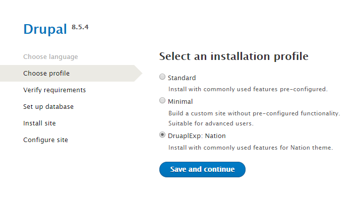

# 2.2 Profile installation

1. Create a new empty database in your phpmyadmin/cPanel tools and create database user.
2. Download the latest version of Drupal 8 from drupal.org, extract and moveto your site location.
3. Copy **drupalexp\_nation** profile folder \(located in Packages/profiles folder\) into **your site profiles** folder.
4. Copy libraries folder \(located in Packages folder\) into your root folder of Drupal.
5. Install the site with profile "DrupalExp: Nation" as image below:

