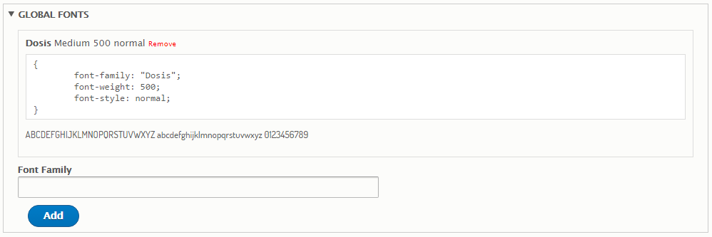

# 3.3 Font Settings

Nation theme support all Google fonts which you can change it easy. To change font in theme. You just click on Font settings tab on left side bar of theme settings.

There are: Global & Elements in font settings.

### Global Font

When you create a global font, you can use it for any elements in your less or stylesheet file

