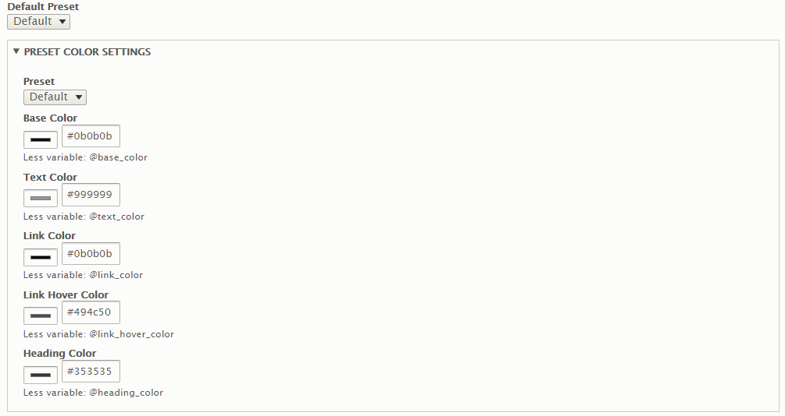

# 3.2 Color Settings

The **Preset** settings provide the functionality to create your own colors so that you can have full control over the color scheme of your website using a hex code.

To manage color in theme, go to theme settings page \([http://yoursite.com/admin/appearance/settings/nation](http://yoursite.com/admin/appearance/settings/nation)\) click on **Preset** settings tab on left sidebar

