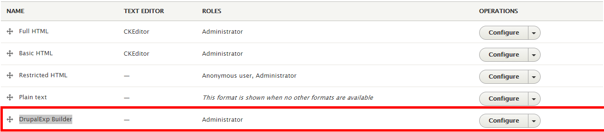

# 5. DrupalExp Builder

### Introduce Dexp builder module

Drupalexp Visual Shortcode Builder is a premium module own by drupalexp author. It allows user create content with visually interface. It includes more shortcode elements which help user build site very fast and no coding require.

You can use it in both page and block.

### Enable Dexp builder module

You must make sure module Drupalexp Visual Shortcode Builder is enabled. After installing it, access to [http://yoursiteurl.com/admin/config/content/formats](http://yoursiteurl.com**/admin/config/content/formats) you will see new text format called Drupalexp Builder

Click on Configure and scroll down, you can choose shortcodes you want to use in your site with this module. Now, when create page/block, you must choose this textformat Drupalexp Builder

