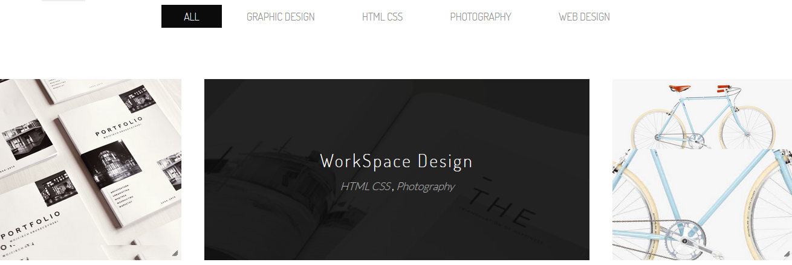
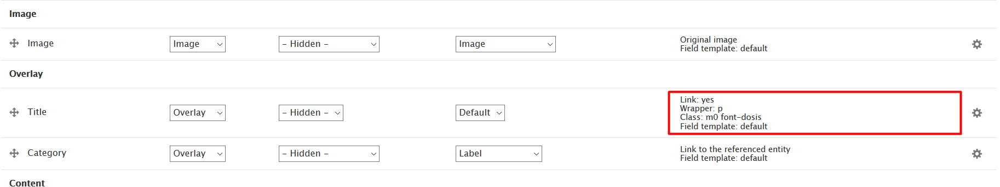

# 8.1 Masonry style 01

Masonry style v1 Layout is defined in nations.layout.yml with unique name: portfolio\_layout\_style1 and template file portfolio-layout-style01.html.twig located at template/layout folder. We use Masonry view mode to show this layout.

Go to Manage Display Portfolio content type. Click on Masonry view mode. Scroll down and click on Layout for portfolio in masonry. Choose Portflio layout style 1. After that, put fields into region exactly as image below, you will have style same as image above.

Note: Click on gear for each of icon to input/modify class for each of field.

