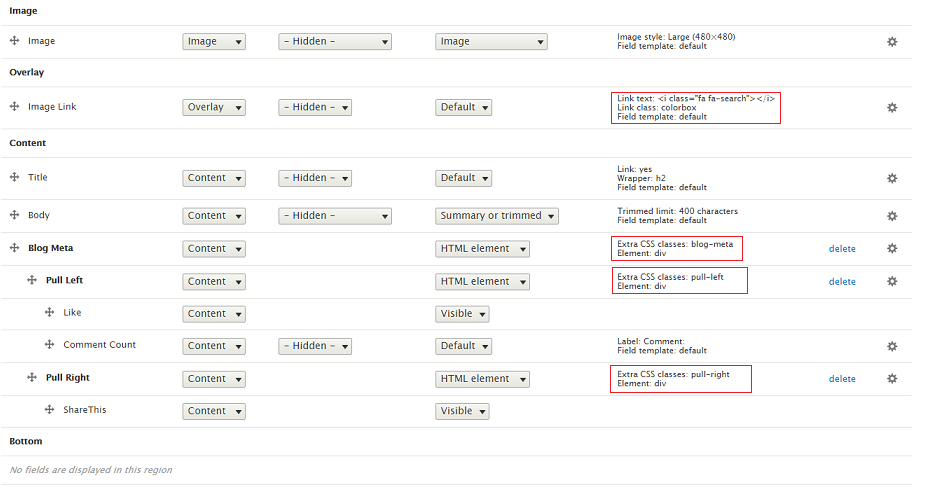

# 9.3 Blog dark slider layout

Dark Slider Layout is defined in nations.layout.yml with unique name: blog\_layout\_dark and template file blog-layout-dark.html.twig located at template/layout folder. Nation Blog use Teaser 3 view mode to show this layout.

Go to Manage Display Article content type. Click on Teaser 3 view mode. Scroll down and click on Layout for article in teaser 03 Choose Blog layout Dark Style. Put fields into region as image below.

Note: Click on gear for each of icon to input/modify class for each of field.

