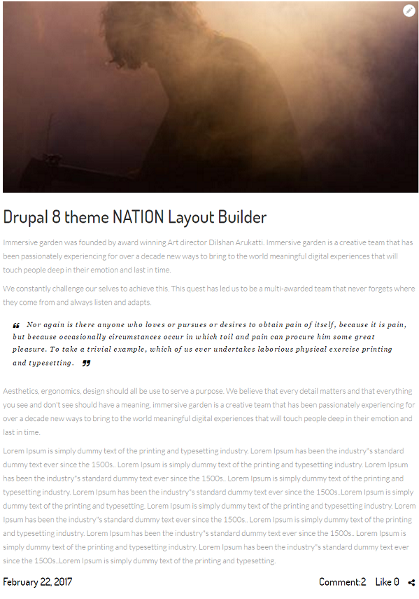
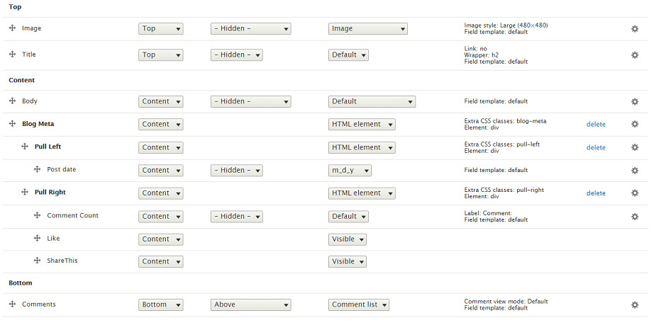

# 9.4 Blog Single Layout

Blog Single Layout is defined in nations.layout.yml with unique name: blog\_layout\_single and template file blog-layout-single.html.twig located at template/layout folder. Nation Blog use Default view mode to show this layout.

Go to Manage Display Article content type. Click on Default view mode. Scroll down and click on Layout for article in default. Choose Blog Single Layout. After that, put fields into region exactly as image below, you will have style same as image above.

Note: Click on gear for each of icon to input/modify class for each of field.

