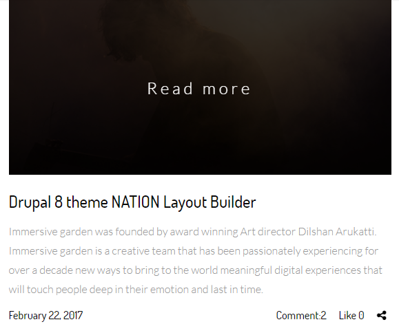
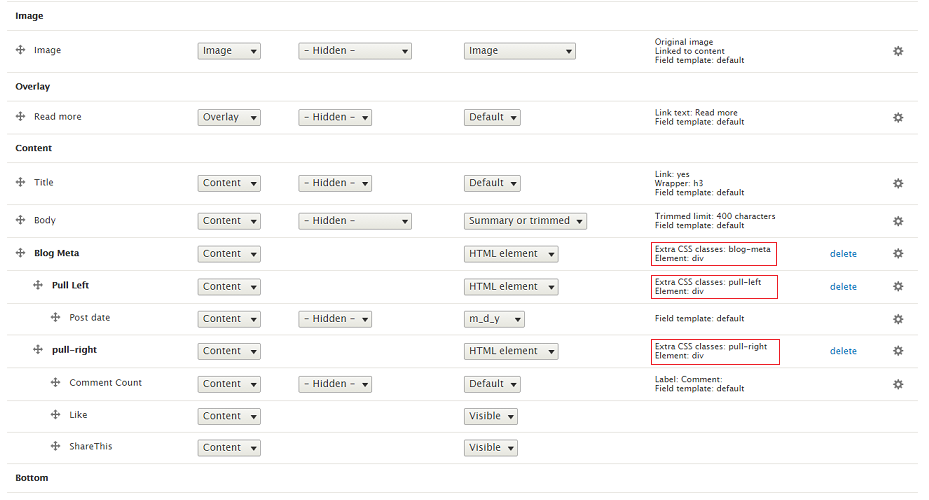

# 9.1 Blog Teaser Layout

Blog Teaser Layout is defined in nations.layout.yml with unique name: blog\_layout\_teaser and template file blog-layout-teaser.html.twig located at template/layout folder. We use Teaser view mode to show this layout.

This is picture apply Blog Teaser Layout

Go to Manage Display Article content type. Click on Teaser view mode. Scroll down and click on Layout for article in teaser. Choose Blog layout Teaser Style. After that, put fields into region exactly as image below, you will have style same as image above.

Note: Click on gear for each of icon to input/modify class for each of field.

