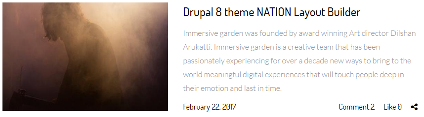
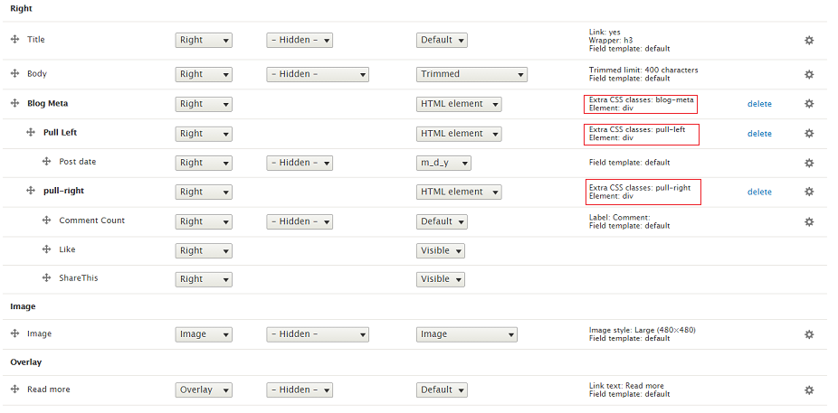

# 9.2 Blog List Layout

This layout with 2 columns Image on Left and Content in Right. Blog List Layout is defined in nations.layout.yml with unique name: blog\_list\_image\_left\_style and template file blog-list-image-left-style.html.twig located at template/layout folder. We use **Teaser 02** view mode to show this layout.

Go to Manage Display Article content type. Click on Teaser 02 view mode. Scroll down and click on Layout for article in teaser 02. Choose Blog List Image Left Style. After that, put fields into region exactly as image below, you will have style same as image above.

Note: Click on gear for each of icon to input/modify class for each of field.

