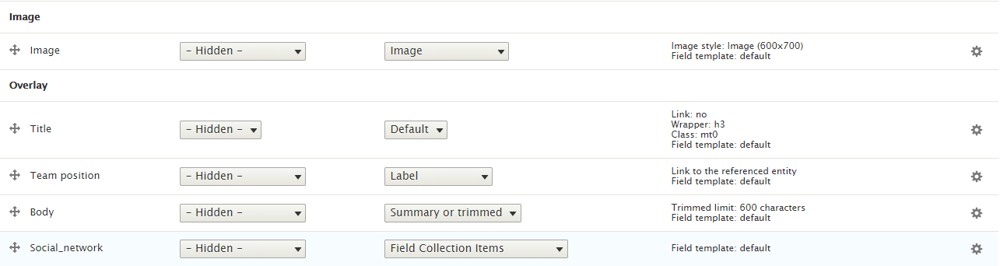

# 10. Team

Nation theme is using **Team** content type for displaying your team members.

**Team Teaser Layout** is defined in nations.layout.yml with unique name: **team\_layout** and template file **team-layout.html.twig** located at **template/layout** folder. We use **Teaser** view mode to show this layout.

Go to Manage Display **Team** content type. Click on **Teaser** view mode, scroll down and click on Layout for team in teaser and choose Team Teaser Layout. After that, put fields into region exactly as image below, you will have style same as image above.

Note: Click on gear for each of icon to input/modify class for each of field.

