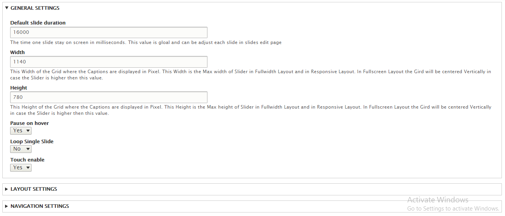

# 6. DrupalExp Layer Slider

Dexp LayerSlider is a premium module which help you build a slider extends from Revolution Slider plugin visually and quickly in Drupal GUI

To create, modify or import, export slider, the first you MUST enable module called.

### Slider settings

If you want to set width, height or 

Click on context menu at top right of block slider and click **slider settings**

